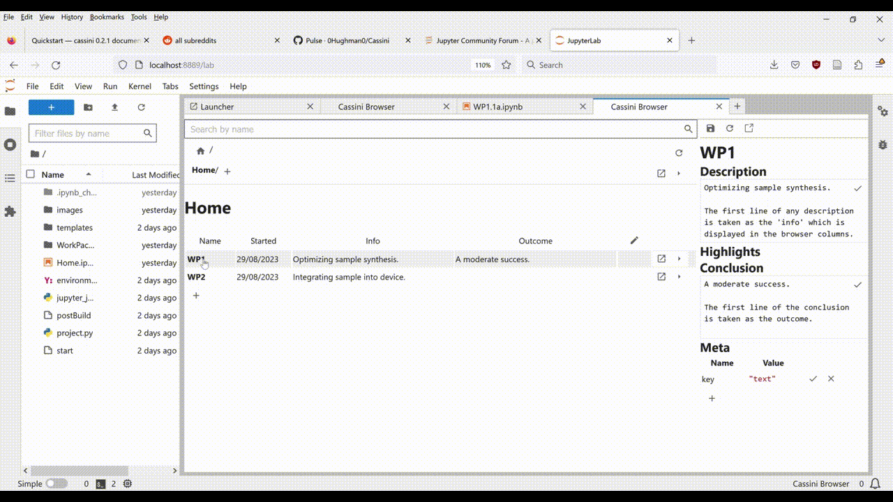

# Cassini

An electronic laboratory notebook (ELN), built inside Jupyter Lab.

Cassini's goal is to help you explore, analyse and organise your data in an environment that's familiar.

## Features

* **Structure your project** into a logical hierarchy _- no more lost data!_
* **Retreive any data from anywhere**, by name _- no more copy and pasting data here there and everywhere!_
* **Navigate and explore** your project through a fast, specialised browser _- no more endless clicking through folders!_
* **Preview summaries of experiment parameters and results**, including graphs, temperatures, volumes, weights _- no more waiting around for notebooks to launch!_
* **Define reusable templates** for proceedures and analysis _- no more copy and pasting code snippets!_

## Installation and Setup

    > pip install cassini

Create a `cas_project.py`:

    # cas_project.py
    from cassini import Project, DEFAULT_TIERS    

    project = Project(DEFAULT_TIERS, __file__)

    if __name__ == '__main__':
        project.launch()

And launch it:

    > python project.py

Head to [Quickstart](https://0hughman0.github.io/Cassini/0.3.x/) for more info.

## Contributing

Contributing guidelines are found [here](https://0hughman0.github.io/Cassini/0.3.x/contributing/).

This includes development installation instructions and codebase orientation.
