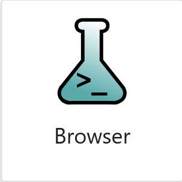

# Welcome to Cassini's documentation!

Cassini enhances Python and Jupyter Lab by providing the features to help you manage and explore your data in a research project.

Features:

* **Structure your project** into a logical hierarchy _- no more lost data!_
* **Retreive any data from anywhere**, by name _- no more copy and pasting data here there and everywhere!_
* **Navigate and explore** your project through a fast, specialised browser _- no more endless clicking through folders!_
* **Preview summaries of experiment parameters and results**, including graphs, temperatures, volumes, weights _- no more waiting around for notebooks to launch!_
* **Define reusable templates** for proceedures and analysis _- no more copy and pasting code snippets!_

## Quickstart

### Installation

```bash
pip install cassini
```

Note that this project is still in active development, so you may encounter some bugs, so please [report them!](https://github.com/0Hughman0/Cassini/issues/new)

### Setup

In the directory you want your project to live, create your `cas_project.py`:

```python
# cas_project.py
from cassini import Project, DEFAULT_TIERS

project = Project(hierarchy=DEFAULT_TIERS, project_folder=__file__)

if __name__ == '__main__':
    project.launch()
```

Launch your new project from the command line:

```bash
python cas_project.py
```

This will setup Cassini and launch Jupyter Lab, with your new project configured.

In Jupyter Lab, open the launcher, scroll to the Cassini section and open the browser.

{ width="100px" }

Create your first WorkPackage by clicking the little plus (<svg xmlns="http://www.w3.org/2000/svg" width="16" viewBox="0 0 24 24" data-icon="ui-components:add" class=""><g xmlns="http://www.w3.org/2000/svg" class="jp-icon3" fill="#616161"><path d="M19 13h-6v6h-2v-6H5v-2h6V5h2v6h6v2z"></path></g></svg>
) button in the empty table.

## What Next

A walkthrough of Cassini's features can be found here:

<div>
<a href="https://mybinder.org/v2/gh/0Hughman0/Cassini/0.3.x?urlpath=lab/tree/Introduction.ipynb"></a>
<i> - Note these binder notebooks can take a while to launch, so maybe click then go grab a cup off tea/ coffee!</i>
</div>

Don't want to wait/ prefer reading? - head to the [Tutorial](./user-guide/installation-setup.md).

[Next](./user-guide/installation-setup.md){ .md-button align=right }
