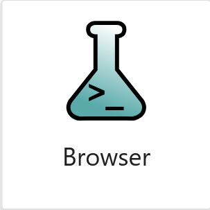
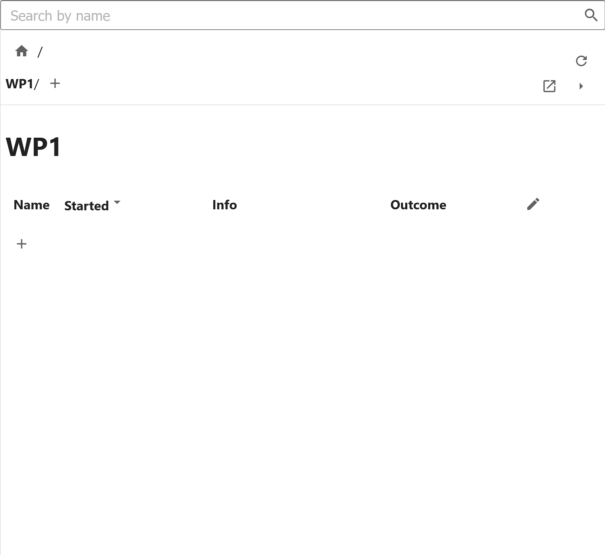

# Creating WorkPackages to DataSets

## Launching the Cassini Browser

Once JupyterLab has opened, open the launcher and scroll down to the Cassini section and click the Cassini Browser button:

{ width="100px" }

This will open the Cassini Browser, which is used to navigate around your project.

When you open the browser, you start at Home, which is the top level of your project.

Initiallly Home has no children, so the browser will be empty:

## Creating a new WorkPackage

Home's children are `WorkPackages`, to fill up the browser, we need to create new `WorkPackages`.

To add a new `WorkPackage` to `Home`, click the plus button in the Tier Table:

<svg xmlns="http://www.w3.org/2000/svg" width="16" viewBox="0 0 24 24" data-icon="ui-components:add" class=""><g xmlns="http://www.w3.org/2000/svg" class="jp-icon3" fill="#616161"><path d="M19 13h-6v6h-2v-6H5v-2h6V5h2v6h6v2z"></path></g></svg>

This will open the New Child Dialogue:

{ width="300px" }

### New Child Dialogue Fields

#### Identifier

A unique string that identifies this tier. Cassini will create a full name from a tier's identifier and those of its parents. You will see a preview of this full name in the top right.

Depending on the tier, this identifier will have different restrictions. For `WorkPackages` and `Experiments`, these must be numbers. For `Samples` and `DataSets`, these must be letters. If you enter an invalid identifier, the box will turn red e.g. if that identifier already exists.

#### Description

A description of the new tier - what's the aim? The first line of the should be a short summary of the tier. You can use more details in the following lines.

!!!Note
    Don't worry if you don't like what you wrote here, you can change this later!

#### Template

The template to use to create a Jupyter Notebook for this tier.

You can find the templates in `project.project_folder / 'templates'`.

Within this folder, you are free to create additional templates for the various tiers as you need.

More information on creating templates and how they work is found [here](templating.md).

#### Meta

Here you can set meta-data values for your new WorkPackage. These are JSON serialisable key-value pairs that are associated with a tier.

!!!Note
    New keys cannot be added in the New Child Dialogue, instead you can set the value for any keys already set in siblings, this is to ensure consistency between siblings. In the case of your first WorkPackage, no keys have been defined, hence you can't set any values here...

There's a lot more to Meta, so you can read more about them [here](./meta.md).

### Create the WorkPackge

Fill in the New Child Dialogue and click ok.

This should have created a new WorkPackage called `WP1`:

You can see Cassini automatically keeps track of when this tier was created, and also includes a summary of the description in the table.

## Navigating in the Browser

Now you have created WP1, you can look at its contents by clicking on its name in the table.

You can see we are now looking at the contents of WP1:

You'll notice `WP1` has no children. As a WorkPackage, `WP1`'s children are Experiments.

You can follow the same proceedure as above to create new Experiments (i.e. clicking the + button). All the children of `WP1` will have names that start with `WP1` e.g. `WP1.5`, or `WP1.5a`, so you can easily identify which `WorkPackage` a tier comes from.

Once you've created an experiment, you can navigate to that, and create new `Samples` within that experiment within those `Samples`, new `DataSets`.

You can head back up the hierarchy by clicking on the identifiers in the Crumbs:

Or if you know the name of the tier you want to look at, you can just search for it by typing its name and pressing enter:

## Opening a Tier's Notebook

The navigator is there to help you look around your project, but the hard work of your project takes place within the notebooks you create. To open a tier's notebook, click the open button within the browser:

<svg xmlns="http://www.w3.org/2000/svg" width="16" viewBox="0 0 24 24" data-icon="ui-components:launcher" class=""><path xmlns="http://www.w3.org/2000/svg" class="jp-icon3 jp-icon-selectable" fill="#616161" d="M19 19H5V5h7V3H5a2 2 0 00-2 2v14a2 2 0 002 2h14c1.1 0 2-.9 2-2v-7h-2v7zM14 3v2h3.59l-9.83 9.83 1.41 1.41L19 6.41V10h2V3h-7z"></path></svg>

!!!Note
    `DataSets` don't have notebooks, they're just folders for you to put data in. Clicking open will open your file explorer at the `DataSet`'s directory - this is incredibly useful for pasting in data!

Next learn how to use cassini within a notebook

[Next](within-the-notebook.md){ .md-button align=right }