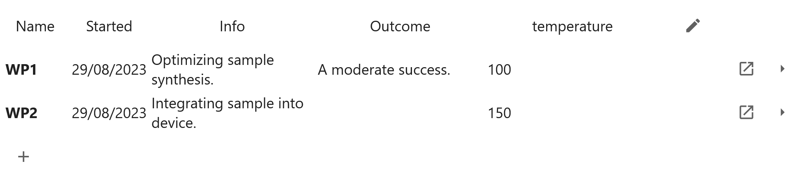

# Tier Meta-data

## In the Notebook

`WorkPackages`, `Experiments` and `Samples` can have meta-data associated with them.

These are just stored in a JSON file on disk:

```python
>>> smpl = project['WP2.1a']
>>> smpl.meta_file
Path('.../WorkPackages/WP2/WP2.1/.smpls/WP2.1a.json')
```

The contents of this file can be access through the `tier.meta` attribute:

```python
>>> smpl.meta
<Meta conclusion='' started=datetime.datetime(2024, 10, 16, 16, 24, 52, 274990, tzinfo=TzInfo(UTC)) description='First Attempt\n\nMore details can be put after the first line. \n\nThis box is rendered as markdown, hence can contain $M\\alpha t \\hbar$.\n' "asd"=['One', 'Two', 'Three'] (6.3ms)>
```

You can see this is where the description and conclusion for your tier is stored, as well as its started time.

Additionally, here you can insert your own meta values.

You can do this from the [preview panel](./preview-panel.md) in the tier browser, or in a notebook, you can create an editor widget using:

```python
smpl.gui.meta_editor(name=['key'])
```

{ width="400px" }

Once you've entered a value, and applied the change, click the save button at the top of the notebook to apply it.

!!!Warning
    Whilst setting of meta values directlly with `smpl.meta['key'] = 'value'` is supported, it is generally not recommended because
    this will take the UI of Cassini out of sync with the file, and may cause confusing errors/ popups. You can explicitly refresh the meta contents
    in the UI through clicking the 🔄 button in the Tier Preview panel.

When values have been set, you can access them python-side with:

```python
>>> smpl.meta['key']
'value'
```

Validation of meta-values is provided by Pydantic. More advanced serialisation and deserialisation can be achieved using [`MetaAttr`](../customization.md#meta-attributes-metaattr).

## In the Cassini Browser

Meta can be seen and edited in the [Preview Panel](./preview-panel.md#meta). 

They can also be viewed in the tier table too.

To do so, simply click the `edit columns` button <svg viewBox="0 0 24 24" width="16" xmlns="http://www.w3.org/2000/svg" data-icon="ui-components:edit" display="inline block"><g xmlns="http://www.w3.org/2000/svg" class="jp-icon3" fill="#616161"><path d="M3 17.25V21h3.75L17.81 9.94l-3.75-3.75L3 17.25zM20.71 7.04c.39-.39.39-1.02 0-1.41l-2.34-2.34c-.39-.39-1.02-.39-1.41 0l-1.83 1.83 3.75 3.75 1.83-1.83z"></path></g></svg>, and select which meta you want to view in the table.



If you have recently set new meta values, and they are not appearing in the table, you can press the refresh tree button <svg xmlns="http://www.w3.org/2000/svg" width="16" viewBox="0 0 18 18" data-icon="ui-components:refresh" display="inline-block"><g xmlns="http://www.w3.org/2000/svg" class="jp-icon3" fill="#616161"><path d="M9 13.5c-2.49 0-4.5-2.01-4.5-4.5S6.51 4.5 9 4.5c1.24 0 2.36.52 3.17 1.33L10 8h5V3l-1.76 1.76C12.15 3.68 10.66 3 9 3 5.69 3 3.01 5.69 3.01 9S5.69 15 9 15c2.97 0 5.43-2.16 5.9-5h-1.52c-.46 2-2.24 3.5-4.38 3.5z"></path></g></svg> to reload all the meta of the children shown in the table.


[Next](./templating.md){ .md-button }