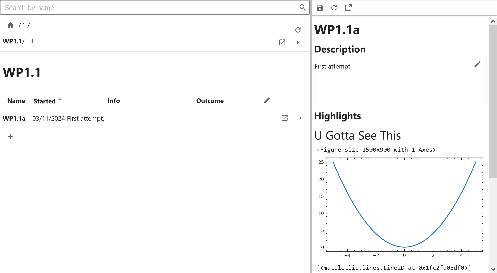
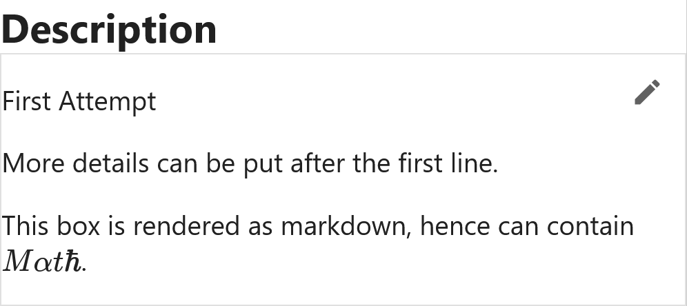
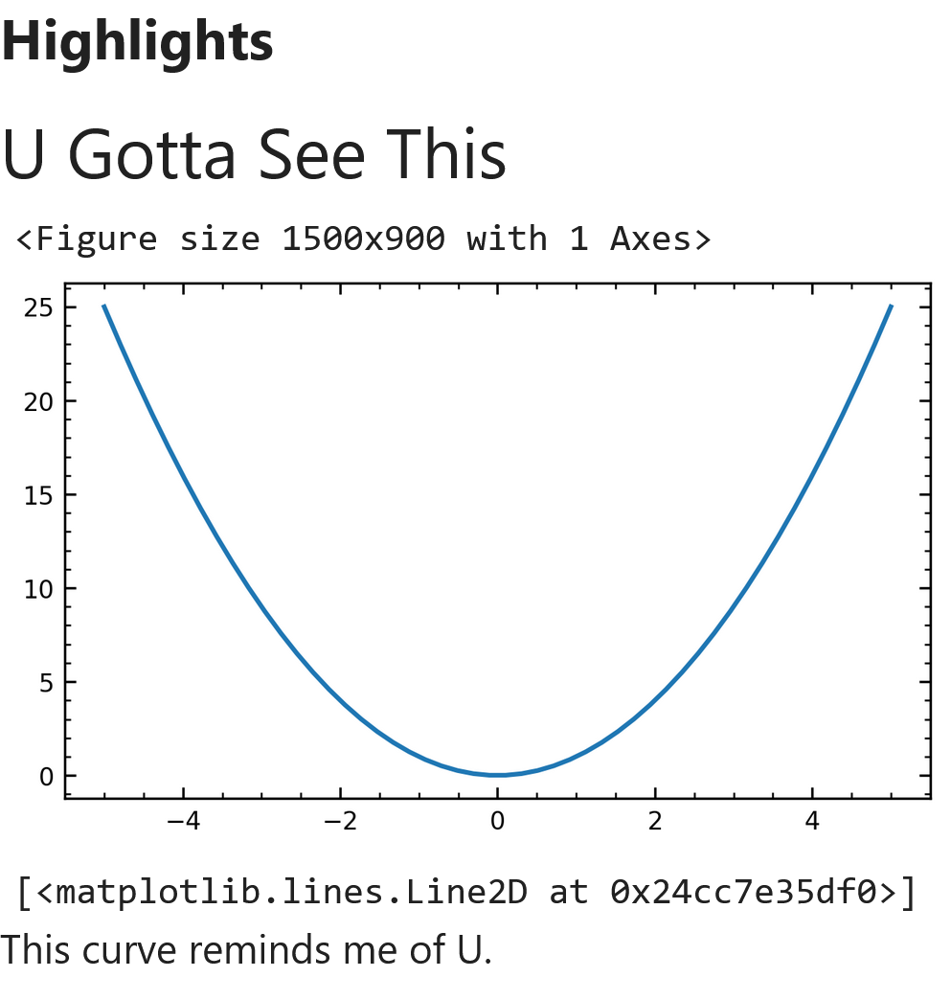
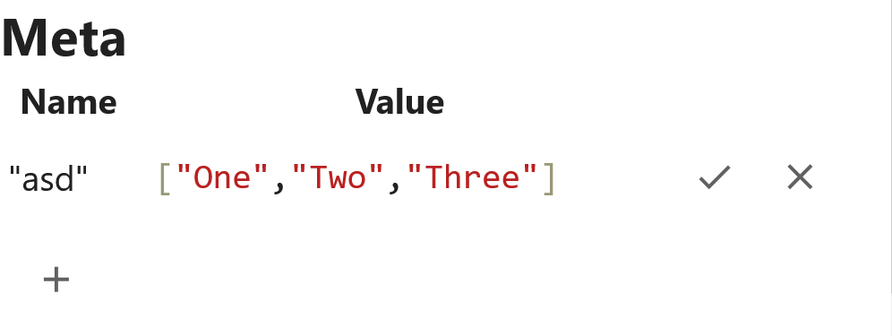

# The Browser Preview Panel

Cassini provides the Browser Preview Panel for you to quickly see a summary of the contents of a tier. 

The preview panel is part of the Tier Browser. You can load a tier into the preview panel by clicking the preview tier button (<svg xmlns="http://www.w3.org/2000/svg" width="16" viewBox="0 0 24 24" display="inline-block"><g xmlns="http://www.w3.org/2000/svg" class="jp-icon3" fill="#616161" shape-rendering="geometricPrecision"><path d="M7.2,5.2L10.9,9l-3.8,3.8V5.2H7.2z"></path></g></svg>).

## Preview Panel Contents

Within the preview panel, you have the following sections...

### Description

{ width="400px" }

A box where you can view and edit the description. Remember, the first line of your description is used in the 'info' column of the browser table.

### Highlights

{ width="400px" }

[Remember these?](within-the-notebook.md#creating-highlights) - here you can see any highlight outputs from tier notebook.

### Conclusion

The conclusion of this tier, works the same as the description. In this case, the first line of this box is used in the 'outcome' column of the browser table.

### Meta

{ width="400px" }

In this section you can attach meta-data to your tier. These can be experimental parameters, summary statistics from your analysis, you name it.

You can add a new metadata item to a tier by clicking the + button and entering a name for it. You can then set the value to be anything that can be serialised as JSON e.g. a string `"make sure to wrap it in quotes though!"`, a number `123`, or even an array of values `["One", "Two", "Three"]`. If you are trying to set an invalid value, the box will turn red.

There's a lot more to tier metadata so they deserve their own section, which is next.

[Next](./meta.md){ .md-button }
