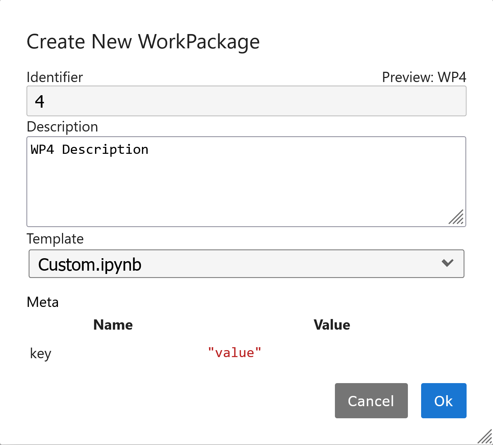

# Templates

Often work involves repeating the same proceedure, collecting the same data and performing the same analysis again and again.

This can lead to a lot of copying and pasting, and cause problems when things aren't replicated properly between runs.

Cassini provides templating of Notebooks to help keep proceedures and analysis uniform.

Notebook templates live in the `project.template_folder`, which is usually in your project's top level directory.

```python
>>> project.template_folder
Path('.../templates')
```

For each Notebook Tier, you will find a default template in this folder. But you can create your own.

Cassini uses the powerful [Jinja2](https://jinja.palletsprojects.com/en/2.10.x/) templating engine.

In short, Python expressions to be used to fill in templates. Regions where Python expressions are to be replaced are wrapped in `{{ expression }}`.

When creating a new Notebook Tier e.g. `WorkPackage`, `Experiment` or `Sample`, Cassini will pass the newly created tier, including any new meta-data to the notebook with the name `tier`. 

For example, the default template has the form:

```python
from cas_project import project

{{ tier.short_type }} = project.env('{{ tier.name }}')
{{ tier.short_type }}.gui.header()
```

When rendered for a `WorkPackage`, this replaced `tier.short_type` with `wp` and `tier.name` with the name of whatever tier you just created.

We could add a Markdown Cell with the contents:

```
# {{ tier.name }}

## started: {{ tier.started }}

> {{ tier.description }}

Meta value = "{{ tier.meta['key'] }}"
```

Then in the New Child Dialogue



This will then render as:

```markdown
# WP4
## started: 2024-10-17 15:13:41.622555+00:00

> WP4 Description

Meta value = "value"
```

You could, for example, create templates that include experimental proceedures, or common analysis scrips.
