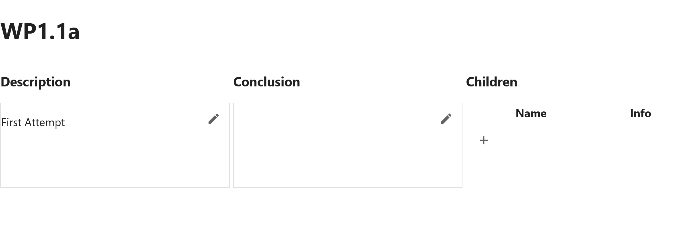

# In the Notebook

Now you've opened up a tier notebook by clicking the open icon:

<svg xmlns="http://www.w3.org/2000/svg" width="16" viewBox="0 0 24 24" data-icon="ui-components:launcher" class=""><path xmlns="http://www.w3.org/2000/svg" class="jp-icon3 jp-icon-selectable" fill="#616161" d="M19 19H5V5h7V3H5a2 2 0 00-2 2v14a2 2 0 002 2h14c1.1 0 2-.9 2-2v-7h-2v7zM14 3v2h3.59l-9.83 9.83 1.41 1.41L19 6.41V10h2V3h-7z"></path></svg>

The default tier templates will have created a first cell that e.g. for `<Sample "WP1.1a">` will look something like:

```python
from cas_project import project

smpl = project.env('WP1.1a')
smpl.gui.header()
```

The first line simply imports the `project` object you defined in your `cas_project.py` file (remember `project.launch()` added it to your `PYTHONPATH` so it can be imported anywhere?).

The second line tells the `project`, I want this notebook (and it's interpretter) to be associated with the `Sample` called `WP1.1a`. It can grab `WP1.1a` by name because it understands your project's naming convention - neat!

The final line creates a nice UI that you can use to edit the description/ conclusion for this tier as well as a list of the tier's children:



## Getting Children and Paths

All tier's have a folder associated with them:

```python
>>> smpl.folder
Path('.../WorkPackages/WP1/WP1.1')
```

And they can act like ``pathlib.Path`` to get relative paths:

```python
>>> smpl.folder / 'diagram.png'
Path('.../WorkPackages/WP1/WP1.1/diagram.png')
```

We can use the `__getitem__` (`tier[id]`) syntax to get children of a tier by it's identifier:

```python
>>> smpl
<Sample "WP1.1a">
>>> smpl['XRD']
<DataSet "WP1.1a-XRD">
```

This is particularly useful for loading data:

```python
>>> import pandas as pd
>>> df = pd.read_csv(smpl['Raman'] / 'raw_data.csv')
```

Anywhere we can import `project` we can access any `tier` by using the `__getitem__` (`project[name]`) syntax:

```python
>>> from cas_project import project
>>> other_data = project['WP2.1c-Raman'] / 'more_raman_data.csv'
```

This becomes incredibly useful when trying to consolidate work, as you can load data without having to move it around.

!!!Tip
    For convenience, iterating over a ``DataSets`` is equivalent to using ``os.scandir``:

    ```python
    >>> raman_dataset = smpl['Raman']
    >>> for entry in raman_dataset:
    ...     print(data)
    DirEntry('.../WP2.1/Raman/c/data1.txt')
    DirEntry('.../WP2.1/Raman/c/data2.txt')
    ```


## Creating Highlights

Now you can load your data into the notebook, you can perform some analysis.

Generally this might result in some key graphs or images.

You can use the `%%hlt` cell magic to mark the output of a cell as a highlight.

You should provide a title for the highlight, and you can also finish the cell with a string that will be used as a caption. e.g.

```python
%%hlt U Gotta See This
x = np.linspace(-5, 5)
plt.plot(x, x * x)
"""
This curve reminds me of U.
"""
```

Cassini will then capture the output of this cell and will allow it to be viewed in the Cassini Browser Preview panel _without_ having to run or open the notebook.

</img>

!!!Note
    Behind the scenes, the `%%hlt` magic only knows which tier to associate the highlight with, because you called `project.env` at the top of your notebook.

You've now added something to the Browser Preview Panel... but what is that? Next learn about this feature.

[Next](./preview-panel.md){ .md-button }
