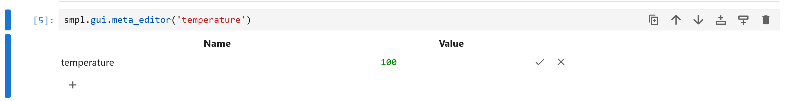

Features
=================

Highlights
----------

Often the outcome of some lab work can be summarised with a few results.

Cassini provides the ``%%hlt`` magic that automatically saves the output of a cell as a highlight.

The highlight can also be titled and captioned::

    In [1]: %%hlt My Title
       ...: x = np.linspace(0, 10)
       ...: plt.plot(x, x * x)
       ...: """
       ...: A caption for WP2.1c
       ...: """

These highlights can then be viewed in the preview panel of the Cassini Browser, without running the notebook.

Templating
----------

Often you may find yourself repeating the same protocol over multiple samples, tweaking and recording various parameters
and producing various outputs. To help streamline this process Cassini supports Jinja2 templating of ``.ipynb`` files.

Cassini creates a templates folder inside your project folder, here you can create 'template' notebooks for each Tier.

When you create a new Tier, cassini fills in the template, using Jinja. 

Tier Meta data
--------------

Often there's key parameters that relate to a particular sample or experiments.

Cassini stores these in a Tier's 'meta' data.

In the notebook, different meta values can be set using the ``meta_editor`` gui.

You access this via::

    smpl.gui.meta_editor('temperature')

which will render something like:

Note that the values for meta must be valid JSON, so strings must be wrapped in quotes. etc.

A summary of a tier's meta can be seen in the preview panel of the cassini browser.

Furthermore, as often a string of samples or experiments will have different meta values, new columns which display the values for a given meta name
can be added to the cassini browser table by right clicking on one of the headings, or clicking the little edit button.

Lastly, a tier's meta can be accessed on the Python side of your project::

    >>> from project import project
    >>> sample = project['WP2.1c']
    >>> sample.meta
    {'description': 'an experiment', 'started': '17/06/2020'}
    >>> sample.meta['started']
    '17/06/2020'

Retrieving Data
---------------

Cassini understands your project naming convention, so you can grab any tier from anywhere::

    >>> from project import project
    >>> sample = project['WP2.1c']

Tiers try to behave a bit like ``pathlib.Path`` objects.

This means we can find paths relative to with ease::

    >>> sample / 'diagram.png'
    Path('.../WP2.1/diagram.png')

This is particularly useful for loading data::

    >>> df = pd.read_csv(sample['Raman'] / 'raw_data.csv')

Additionally, iterating over a ``DataSets`` is equivalent to using ``os.scandir``::

    >>> raman_dataset = sample['Raman']
    >>> for entry in raman_dataset:
    ...     print(data)
    DirEntry('.../WP2.1/Raman/c/data1.txt')
    DirEntry('.../WP2.1/Raman/c/data2.txt')

Exploring Work
--------------

Each ``Tier`` has a ``children_df()`` method which automatically generates a DataFrames with each child, including
custom metadata, allowing you to quickly query your work::

    >>> wp = project['WP2.1']
    >>> wp.children_df().query("'temperature' > 90")

The ``wp.gui.children_df()`` provides clickable links to these ``Tiers``.
